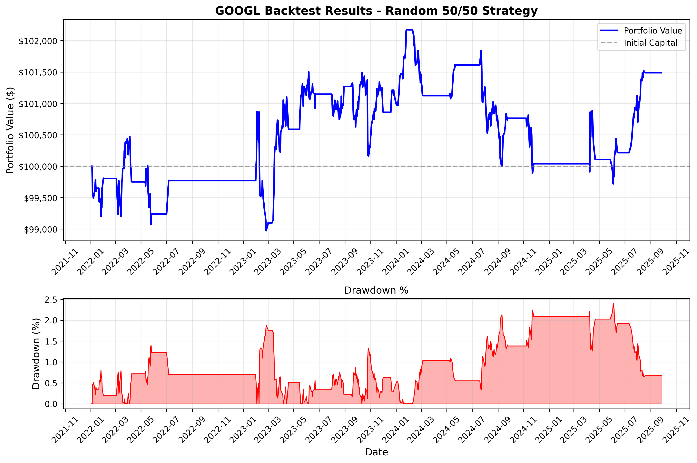
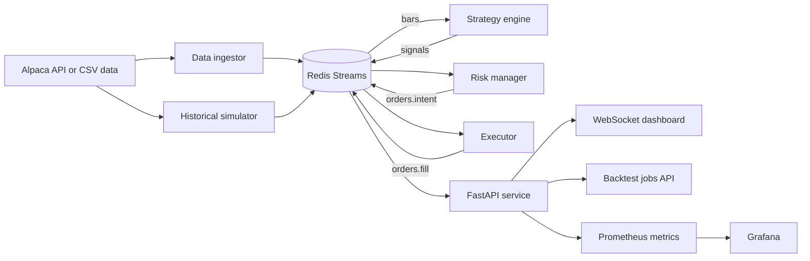

# Alpaca Algorithmic Trading Platform

Trading systems are mostly coordination problems: market data arrives continuously, strategies create signals, risk checks must gate orders, and execution needs idempotency so retries do not create duplicate broker requests. This repository implements that workflow in Python with separate services connected through Redis Streams, plus backtesting, persistence, API access, and monitoring.

The default mode is paper trading and simulation. Live trading is disabled by default and should not be enabled without a separate review of credentials, risk controls, broker behavior, and operational safeguards.

**Core stack:** Python, FastAPI, Redis Streams, Alpaca API, Pydantic v2, Prometheus, Grafana, WebSockets, SQLite, CSV/Parquet export, pytest, Docker Compose, GitHub Actions.



The included backtest artifact shows the output generated by `scripts/sim_random.py`: portfolio value, initial capital, and drawdown over time for a reproducible random 50/50 strategy run on GOOGL.

## System overview



The services communicate through typed event streams:

- `bars`: OHLCV market data from live ingestion, CSV replay, or historical simulation.
- `signals`: strategy output with symbol, side, confidence, timestamp, and metadata.
- `orders.intent`: validated order requests emitted by the risk manager.
- `orders.fill`: execution results and broker fill events.
- `system`: service events, runtime configuration, health checks, and control messages.

Redis Streams are the primary bus backend. Pub/Sub and FakeRedis are kept for compatibility and local development.

## Repository layout

```text
apps/
  api/              FastAPI endpoints, WebSocket dashboard, backtest job manager
  data_ingestor/    Alpaca market data ingestion
  executor/         Alpaca paper order submission and order lifecycle handling
  pnl_aggregator/   Portfolio and PnL aggregation
  risk_manager/     Market hours, position limits, circuit breakers, deduplication
  simulator/        Historical replay and persistence
  strategies/       Random baseline and technical indicator strategies

lib/
  models.py         Pydantic contracts for bars, signals, orders, fills, portfolios
  bus.py            Message bus abstraction
  bus_streams.py    Redis Streams implementation
  order_fsm.py      Order lifecycle finite state machine
  deduplication.py  Duplicate order prevention
  metrics_helpers.py Prometheus metrics helpers
  settings.py       Environment based configuration
  time_utils.py     Timezone, monotonic timing, and rate limit utilities

scripts/
  sim_random.py                  Rapid backtesting entry point
  control.py                     Service controller
  validate_epic4_5_simple.py     Idempotency and FSM validation
  validate_epic6_7.py            Market hours and persistence validation
  qa/                            Stream, metrics, and end to end checks

.github/workflows/
  ci.yml          Linting, tests, type checks, health checks, security scanning
  nightly.yml     Python and Redis matrix, persistence verification, long backtest
  release.yml     Versioned release validation and package build
```

## Implemented workflow

### Market data and simulation

The platform can ingest Alpaca market data or replay historical bars through the same event pipeline. The simulator supports configurable symbols, date ranges, timeframes, playback speed, seeds, CSV input, and persistent output.

```bash
python apps/simulator/main.py \
  --symbols AAPL,GOOGL,TSLA \
  --start 2024-01-01 \
  --end 2024-01-31 \
  --timeframe 1Day \
  --speed 5.0 \
  --seed 42 \
  --persist
```

### Strategy generation

Two strategy paths are included:

- `random_50_50`: a seeded baseline for infrastructure testing and reproducibility checks.
- `smart_technical`: a technical indicator strategy using SMA, RSI, and MACD signals.

Strategies consume `bars` and publish typed `signals`. Runtime strategy configuration can be sent through the `system` stream, including reproducible seed updates.

```python
from lib.bus import connect_bus, get_bus

connect_bus()
bus = get_bus()

bus.publish_system_event(
    event_type="strategy_config",
    source="backtester",
    data={
        "config_type": "reproducible_mode",
        "random_seed": 42,
    },
)
```

### Risk gate

The risk manager validates every signal before an order intent is published. The implemented checks include:

- NYSE/NASDAQ market hours, holidays, weekends, and early closes.
- Confidence thresholding and signal expiry.
- Position sizing from portfolio value and risk percentage.
- Position and order limits.
- Monotonic time based rate limiting.
- Emergency stop and circuit breaker handling.
- Persistent deduplication through Redis.

Order intent IDs are deterministic where needed, so retries can reuse the same broker client order ID instead of producing duplicate orders.

### Execution and order lifecycle

The executor integrates with Alpaca paper trading and tracks order state transitions through a finite state machine. The FSM covers 13 states: `new`, `submitted`, `pending_new`, `accepted`, `partially_filled`, `pending_cancel`, `pending_replace`, `filled`, `canceled`, `rejected`, `expired`, `replaced`, and `suspended`.

The executor includes:

- broker order submission,
- duplicate order blocking by `client_order_id`,
- safe 429 and 5xx retry handling,
- partial fill tracking,
- timeout handling for submitted and partially filled orders,
- Prometheus counters for duplicate blocking and broker retries.

## Backtesting and output artifacts

For fast local testing, use the standalone backtester:

```bash
python scripts/sim_random.py \
  --symbol GOOGL \
  --start 2021-01-01 \
  --initial-cash 100000 \
  --position-notional 10000 \
  --slippage-bps 3 \
  --seed 42 \
  --plot out/GOOGL.png \
  --output out/GOOGL.json
```

Or use the Make target:

```bash
make backtest-googl
```

Backtest and simulation runs can persist:

- SQLite database: `backtest.db`
- summary JSON: `summary.json`
- CSV exports under `data/`
- Parquet exports when `pyarrow` is installed
- SHA256 hash of ordered fills for reproducibility checks

Example persisted layout:

```text
out/run_<timestamp>_<uuid>/
  backtest.db
  summary.json
  data/
    bars.csv
    signals.csv
    orders.csv
    fills.csv
    equity.csv
    positions.csv
```

The repository also includes small reproducibility fixtures under `out/repro_test_1/` and `out/repro_test_2/`.

## API and dashboard

The FastAPI service exposes health, monitoring, portfolio, signal, and backtest endpoints. When running locally, the main API is available at:

```text
http://127.0.0.1:8001
```

Useful endpoints:

```text
GET  /health
GET  /status
GET  /metrics
GET  /dashboard
WS   /ws/dashboard
POST /signals/manual
GET  /signals/history
GET  /portfolio
GET  /positions/{symbol}
POST /backtest/jobs
GET  /backtest/jobs
GET  /backtest/jobs/{job_id}
POST /backtest/jobs/{job_id}/start
POST /backtest/jobs/{job_id}/cancel
GET  /backtest/jobs/{job_id}/results
GET  /backtest/jobs/{job_id}/download
POST /backtest/quick
```

Example backtest job:

```bash
curl -X POST http://127.0.0.1:8001/backtest/jobs \
  -H "Content-Type: application/json" \
  -d '{
    "symbols": ["AAPL", "GOOGL"],
    "start_date": "2023-01-01",
    "end_date": "2023-12-31",
    "timeframe": "1Day",
    "seed": 42,
    "strategies": ["random_50_50"],
    "initial_cash": 100000
  }'
```

## Observability

Prometheus metrics are exposed by the API and individual services. Grafana and Prometheus configuration files are included for local monitoring.

Representative metrics:

```promql
signals_received_total
signals_approved_total
signals_rejected_total
order_intents_published_total
duplicate_order_blocked_by_client_id_total
broker_429_retries_total
redis_streams_pending
redis_streams_lag
portfolio_value_usd
position_size
```

Local access points:

```text
FastAPI dashboard: http://127.0.0.1:8001/dashboard
Swagger docs:       http://127.0.0.1:8001/docs
Prometheus:         http://127.0.0.1:9090
Grafana:            http://127.0.0.1:3000
Redis Commander:    http://127.0.0.1:8081
```

Grafana credentials used by the local config:

```text
admin / trading123
```

## Run locally

### Prerequisites

- Python 3.9+
- Redis 6.0+, Redis 6.2+ recommended for `XAUTOCLAIM`
- Docker, optional but useful for Redis, Grafana, Prometheus, and Redis Commander
- Alpaca paper trading credentials, optional for CSV and offline simulation

### Install

```bash
git clone <repository-url>
cd alpaca

python -m venv .venv
source .venv/bin/activate
pip install -r requirements.txt
```

On Windows:

```bash
python -m venv .venv
.venv\Scripts\activate
pip install -r requirements.txt
```

### Start Redis

With Docker Compose:

```bash
docker compose up -d redis
```

Or with the Make target:

```bash
make redis-start
```

### Configure environment

The setup script can create a local `.env` file:

```bash
bash scripts/setup.sh
```

For manual setup, create `.env` with at least:

```bash
APCA_API_BASE_URL=https://paper-api.alpaca.markets
APCA_API_KEY_ID=your_key_here
APCA_API_SECRET_KEY=your_secret_here

SYMBOLS=AAPL,MSFT,GOOGL,TSLA,NVDA
HISTORICAL_DAYS=7
RISK_PCT=0.02

BUS_BACKEND=streams
REDIS_URL=redis://127.0.0.1:6379/15
USE_FAKE_REDIS=0

RISK_METRICS_PORT=8011
EXECUTOR_METRICS_PORT=8012
API_METRICS_PORT=8016
```

For local development without Redis:

```bash
export USE_FAKE_REDIS=1
```

### Smoke test the pipeline

Terminal 1:

```bash
export BUS_BACKEND=streams
export REDIS_URL=redis://127.0.0.1:6379/15
python apps/risk_manager/main.py
```

Terminal 2:

```bash
export BUS_BACKEND=streams
export REDIS_URL=redis://127.0.0.1:6379/15
python apps/executor/main.py
```

Terminal 3:

```bash
export BUS_BACKEND=streams
export REDIS_URL=redis://127.0.0.1:6379/15
python - <<'PY'
from decimal import Decimal
from lib.bus import connect_bus, get_bus
from lib.models import Signal, SignalSide

connect_bus()
bus = get_bus()

signal = Signal(
    symbol="GOOGL",
    side=SignalSide.BUY,
    confidence=Decimal("0.9"),
    price=Decimal("151.00"),
    source="manual_test",
)

bus.publish_signal(signal)
print("Signal published")
PY
```

Expected behavior:

- The risk manager consumes the signal, applies market and risk checks, and publishes an order intent when valid.
- The executor consumes the order intent and submits or simulates the broker side depending on credentials and configuration.
- Metrics counters update on the service metrics ports.

## Test and validation commands

Run the full pytest suite:

```bash
export BUS_BACKEND=streams
export REDIS_URL=redis://127.0.0.1:6379/15
python -m pytest tests/ -v
```

Focused checks:

```bash
python -m pytest tests/test_epic3_auth.py -v
python -m pytest tests/test_epic3_websocket.py -v
python -m pytest tests/test_epic4_idempotency.py -v
python -m pytest tests/test_epic5_order_fsm.py -v
python -m pytest tests/test_epic6_market_hours.py -v
python -m pytest tests/test_epic7_persistence.py -v
python -m pytest tests/test_edge_cases.py -v
python -m pytest tests/test_load_performance.py -v -m slow
```

Scripted validation:

```bash
python scripts/validate_epic4_5_simple.py
python scripts/validate_epic6_7.py
python scripts/test_system_health.py
bash scripts/qa/streams_low_level_check.py
bash scripts/qa/e2e_streams_pipeline.sh
bash scripts/qa/metrics_smoke_strict.sh
```

CI workflows run the same families of checks across linting, typing, unit tests, health checks, security scans, Redis compatibility, persistence verification, and long running backtests.

## Configuration reference

Main configuration lives in `configs/base.yaml`. Runtime overrides are loaded from environment variables through `lib/settings.py`.

Key settings:

```yaml
symbols:
  - AAPL
  - MSFT
  - GOOGL
  - TSLA
  - NVDA

risk:
  max_daily_loss: 0.05
  max_portfolio_risk: 0.20
  max_position_size: 0.10
  stop_loss_pct: 0.02
  take_profit_pct: 0.06

execution:
  order_type: market
  time_in_force: day
  max_retries: 3
  retry_delay: 5

features:
  live_trading: false
  machine_learning: false
  crypto_trading: false
  options_trading: false
```

CSV input should use this format:

```csv
timestamp,open,high,low,close,volume
2024-01-01T09:30:00-05:00,150.00,152.00,149.00,151.00,1000000
2024-01-01T09:31:00-05:00,151.00,153.00,150.50,152.50,1200000
```

Place files under:

```text
data/csv/SYMBOL.csv
```

## CI and release workflow

The repository includes three GitHub Actions workflows:

```text
ci.yml
  push and pull request checks: lint, formatting, type checks, tests, health checks, security scans

nightly.yml
  scheduled matrix over Python 3.9, 3.10, 3.11 and Redis 6.0, 6.2, 7.0
  includes long running backtest and reproducibility verification

release.yml
  version tag validation, full test run, package build, release archive, GitHub release draft
```

## Troubleshooting

### Redis is not reachable

```bash
redis-cli ping
```

Expected output:

```text
PONG
```

Fallback options:

```bash
export USE_FAKE_REDIS=1
export BUS_BACKEND=pubsub
```

### Ports are already in use

```bash
python scripts/control.py stop
lsof -tiTCP:8001,8011,8012,9090,3000 -sTCP:LISTEN | xargs kill -9
```

### Alpaca credentials are missing

CSV backtests and local simulations can still run. For broker or market data calls, set:

```bash
APCA_API_KEY_ID=...
APCA_API_SECRET_KEY=...
APCA_API_BASE_URL=https://paper-api.alpaca.markets
```

### Parquet export is skipped

Parquet export is optional. Install `pyarrow` if you want `.parquet` outputs:

```bash
pip install pyarrow
```

## Development notes

The implementation is organized around operational failure modes that appear in event driven trading systems: duplicate messages, stale signals, out of hours orders, broker retries, partial fills, service restarts, and reproducible simulation outputs. The repository keeps the random strategy as a baseline because it is useful for deterministic pipeline testing; it is not intended to represent a profitable trading strategy.

For implementation milestones and validation notes, see:

- [DEVELOPMENT_HISTORY.md](DEVELOPMENT_HISTORY.md)
- [FIXES_SUMMARY.md](FIXES_SUMMARY.md)
- [docs/QUICK_START.md](docs/QUICK_START.md)
- [.github/CI_CD_README.md](.github/CI_CD_README.md)

## License

See `LICENSE` if present in the repository.
